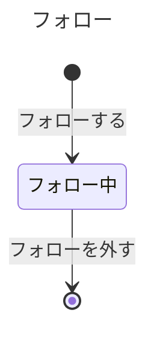

# フォローの業務知識

X のクローンで、利用者が読みたい相手をフォローし、外し、フォローする相手を探すときに、誰が何を行えて何が拒まれるかを、業務を知る人と作り手が同じ言葉で判断するための業務知識である。この業務は、利用者がほかの利用者をフォローしたときに始まり、そのフォローを外したときに終わる。後ろに置くコマンドデータモデルとクエリデータモデルは、この資料だけを業務の根拠にする。

# 概要

フォローは、利用者が自分のホームタイムラインで読みたい相手を、自分で選んで決めておく業務である。利用者は、登録済みの利用者の一覧から相手を探してフォローし、読みたくなくなれば外す。一人がフォローしていられる相手は5,000人までで、自分自身、存在しない利用者、すでにフォローしている相手はフォローできない。そうしなければ、同じ相手が二重に数えられたり、一人の読みたい相手が際限なく増えたりして、誰を読んでいるかを利用者自身もサービスも同じように判断できなくなるからである。

利用者の登録と、利用者と利用者IDという語は、アカウントの業務が担う。この業務は、登録済みの利用者を所与として扱う。フォロー中の相手のポストをホームタイムラインに見せるかはホームタイムラインの業務の決まりで、この業務はだれがだれをフォロー中かという事実を渡すだけである。フォローが成立してからホームタイムラインに相手のポストが見えるまでの時間差は、仕組みの関心なので、この業務の決まりに入れない。

# ユビキタス言語

業務の言葉と英名の対応は次のとおりである。利用者と利用者IDはアカウントの業務が決める語で、アカウントの資料がまだ無いため英名を `未定` にしている。

| 業務の言葉 | 英名 | 種類 | 持ち主 |
|---|---|---|---|
| 利用者 | 未定 | 業務用語 | [アカウントの業務知識](../アカウント/business-knowledge.md) |
| 利用者ID | 未定 | 業務用語 | [アカウントの業務知識](../アカウント/business-knowledge.md) |
| フォロー | Follow | 業務用語 | この資料 |
| フォロワー | Follower | 業務用語 | この資料 |
| フォロー相手 | Followee | 業務用語 | この資料 |
| フォロー上限 | FollowLimit | 業務用語 | この資料 |
| フォロー中の人数 | FollowingCount | 業務用語 | この資料 |
| 本人 | Self | 業務用語 | この資料 |
| フォローしていない | NotFollowing | 業務用語 | この資料 |
| フォローした | Followed | 業務イベント | この資料 |
| フォローを外した | Unfollowed | 業務イベント | この資料 |
| フォロー中 | Following | 状態 | この資料 |
| フォローする | FollowUser | コマンド | この資料 |
| フォローを外す | UnfollowUser | コマンド | この資料 |
| フォロー中の相手を知る | ListFollowees | クエリ | この資料 |
| フォローする相手を探す | FindUsersToFollow | クエリ | この資料 |

## 業務用語

### フォロー

一人の利用者が、別の一人の利用者の書くものを読みたいと決めたことである。フォローしたときに始まり、外したときに終わる。同じ二人の間でも、外した後にもう一度フォローすれば、前とは別の新しいフォローになる。

### フォロワー

フォローを行った側の利用者である。フォローを外せるのも、フォロー上限を数えられるのも、このフォロワーについてである。

### フォロー相手

フォロワーがフォローした側の利用者である。要件の「相手」を、フォローの中の役割として呼ぶための語で、仮に置いている（「まだ決まっていないこと」を参照）。フォロー相手の側からは、フォローを始めることも終えることもできない。

### フォロー上限

一人の利用者が同時にフォロー中にしていられる相手の数の上限で、5,000人である。フォロー中の人数が4,999人なら次の一人をフォローでき、5,000人ならフォローできない。外したフォローは数えない。

### フォロー中の人数

一人の利用者がフォロワーになっている、フォロー中のフォローの数である。フォローするときに、フォロー上限に達しているかを判断するために使う。

### 本人

フォローする相手を探す一覧を見ている利用者自身である。一覧には本人も並び、本人であることが分かるように区別される。本人は自分をフォローできない。

### フォローしていない

一覧を見ている利用者から見て、本人でもなく、フォロー中のフォローも無い利用者である。フォローを外した相手も、外した後はフォローしていない相手に戻る。

## 業務イベント

### フォローした

フォロワーがフォロー相手をフォローした。フォロー中のフォローが一つ生まれ、フォロワーのフォロー中の人数が一人増える。以後、フォロー相手はフォロワーのホームタイムラインで読む相手になる。

### フォローを外した

フォロワーがフォロー中のフォローを外した。そのフォローは終わり、フォロワーのフォロー中の人数が一人減る。以後、その相手はフォロワーから見てフォローしていない相手になり、フォロワーはもう一度フォローできる。

# 概念

## フォロー

フォローは、フォロワーとフォロー相手という二人の利用者の間の、向きのある関係である。AがBをフォローしていても、BがAをフォローしていることにはならない。フォローを始めるのも終えるのもフォロワーだけで、フォロー相手の同意や操作は要らない。同じフォロワーと同じフォロー相手の間に、フォロー中のフォローは同時に一つしかない。

## フォロー中の人数

フォロー中の人数は、一人のフォロワーが今いくつのフォローをフォロー中にしているかという、その時点の事実である。一つのフォローの中には無く、そのフォロワーのフォローをすべて見て初めて分かる。フォローできるかは、この人数とフォロー上限で決まる。

# 常に守られること

### 同じフォロワーと同じフォロー相手の間に、フォロー中のフォローは一つしかない

二重にフォローできると、フォロー中の人数が実際に読んでいる相手の数とずれ、一度外しても別のフォローが残って、利用者は外したはずの相手を読み続けることになる。

### 一人の利用者のフォロー中の人数は、5,000人を超えない

上限を超えてフォローできると、一人の読みたい相手が際限なく増え、要件が合意した最大フォロー数が意味を持たなくなる。

### 利用者は自分自身をフォローしない

自分のポストは、フォローしなくてもホームタイムラインの表示対象である。自分をフォローできると、フォロー中の人数に読み手ではない自分が数えられ、一覧の「本人」と「フォロー中」の区別も崩れる。

### フォローを始め、終えられるのは、そのフォロワー本人だけである

ほかの利用者が代わりにフォローしたり外したりできると、利用者は自分のホームタイムラインで何を読むかを自分で決められなくなる。

### 成立したフォローとフォロー解除は、成立した順に後から説明できる

利用者から「フォローしたはずの相手がいない」「外していないのに外れている」と問い合わせがあったとき、サービスの運営者は、その利用者がいつ誰をフォローし、いつ外したかを成立した順に示して答える（説明の相手と目的は仮置き。「まだ決まっていないこと」を参照）。説明できなければ、利用者の記憶とサービスの状態のどちらが正しいかを示せない。拒まれたフォローとフォロー解除は、成立した事実として残さない。今フォロー中かどうかと、成立した事実の片方だけが変わった状態も正常としない。

# 状態と、その移り変わり

## フォローは外すと終わり、状態はフォロー中の一つだけ



フォローを外すとそのフォローは終わり、「外した」という状態では残らない（仮置き。「まだ決まっていないこと」を参照）。外したことは「フォローを外した」の業務イベントで後から説明する。同じ相手をもう一度フォローすると、終わったフォローが戻るのではなく、新しいフォローがフォロー中で生まれる。

# 業務の行い

## コマンド

### フォローする

登録済みの利用者本人だけが、自分をフォロワーとしてフォローできる。ほかの利用者が代わりにフォローすると、本人が選んでいない相手が本人のホームタイムラインに入り込む。利用者登録を終えていない人は、まだ利用者ではないのでフォローできない。

フォローできるのは、フォロー相手が登録済みの別の利用者で、同じ相手とのフォロー中のフォローがまだ無く、フォロワーのフォロー中の人数がフォロー上限の5,000人未満のときである。4,999人をフォロー中なら5,000人目をフォローでき、5,000人をフォロー中なら次の一人はフォローできない。フォローするとフォロー中のフォローが生まれ、「フォローした」が起きる。以前に外した相手をもう一度フォローしたときも、新しいフォローが生まれ、「フォローした」が起きる。

フォローとフォロー解除を一人が短い時間に何回行えるか（合わせて20回/分、100回/日）は、仕組みを守るための値なので、品質要求（非機能要件の負荷保護）に置いた。

#### 拒む理由: 利用者登録を終えていない人がフォローする

Googleで本人確認できても、利用者登録を終えていない人は利用者ではない。利用者でない人のフォローを認めると、誰のフォローかが業務の上で決まらない。登録の決まりはアカウントの業務が持つ。

#### 拒む理由: ほかの利用者としてフォローする

フォロワーになれるのは本人だけである。ほかの利用者として行うと、その利用者が選んでいない相手をフォローさせてしまう。

#### 拒む理由: 自分自身をフォローする

利用者は自分自身をフォローしない。自分のポストはフォローしなくても読めるので、自分をフォローしても読む相手は増えず、フォロー中の人数だけが狂う。

#### 拒む理由: 存在しない利用者をフォローする

フォロー相手は登録済みの利用者でなければならない。存在しない相手をフォローすると、読む相手のいないフォローがフォロー中の人数を占める。

#### 拒む理由: すでにフォロー中の相手をフォローする

同じフォロワーと同じフォロー相手の間に、フォロー中のフォローは一つしかない。二重にすると、外したはずの相手が残る。

#### 拒む理由: フォロー上限に達している利用者がフォローする

フォロー中の人数が5,000人の利用者がさらにフォローすると、フォロー上限を超える。

### フォローを外す

フォロワー本人だけが、自分のフォローを外せる。ほかの利用者が外せると、本人が読みたい相手が本人の知らないうちにホームタイムラインから消える。フォロー相手の側からも外せない。利用者登録を終えていない人は、外すフォローを持たない。

外せるのは、フォロワーとその相手の間にフォロー中のフォローがあるときである。外すとそのフォローは終わり、「フォローを外した」が起きる。フォロー中の人数は一人減るので、フォロー上限の5,000人に達していた利用者も、一人外せば次の一人をフォローできる。外した相手は、外した後はフォローしていない相手になる。

#### 拒む理由: 利用者登録を終えていない人がフォローを外す

利用者登録を終えていない人は利用者ではなく、外せるフォローを持たない。登録の決まりはアカウントの業務が持つ。

#### 拒む理由: ほかの利用者としてフォローを外す

フォローを終えられるのはフォロワー本人だけである。ほかの利用者として外すと、その利用者が読みたい相手を本人の知らないうちに消してしまう。

#### 拒む理由: フォローしていない相手のフォローを外す

外すフォローが無いので、何も変わらない。成立していないフォロー解除を事実として残すと、後からの説明で、無かったフォローを外したことになってしまう。自分自身と存在しない利用者も、フォロー中のフォローが無いのでこの理由で拒む。

## クエリ

### フォロー中の相手を知る

利用者本人だけが、自分がフォロワーになっているフォロー中の相手を知ることができる（誰が知ることができるかは仮置き。「まだ決まっていないこと」を参照）。ホームタイムラインの業務も、本人のホームタイムラインに誰のポストを見せるかを決めるために、この事実を読む。

見せるのは、その利用者がフォロワーになっているフォロー中のフォローのフォロー相手の、利用者IDである。外したフォローの相手は見せない。フォロー中の人数はフォロー上限の5,000人を超えないので、見せる相手も5,000人以下である。フォロー中の相手が0人なら、何も見えないのが正しい結果である。並びは利用者IDの小さい順にする（仮置き。「まだ決まっていないこと」を参照）。

#### 拒む理由: 利用者登録を終えていない人がフォロー中の相手を知る

利用者登録を終えていない人は利用者ではなく、フォロー中のフォローを持たない。

#### 拒む理由: ほかの利用者のフォロー中の相手を知る

誰を読んでいるかは、その利用者本人のものとして扱う（仮置き）。要件は、他者について見られるものをユーザータイムラインに限っている。

### フォローする相手を探す

登録済みの利用者なら誰でも、フォローする相手を探すために行える。利用者登録を終えていない人は、まだフォローできないので、探す理由が無い。

見せるのは、登録済みの利用者全員で、見ている本人も含む。一人ごとに、利用者IDと、見ている利用者から見た区別（本人、フォロー中、フォローしていない）を見せる。フォロー中は、見ている利用者がフォロワーになっているフォロー中のフォローがある相手で、相手が見ている利用者をフォローしているかは区別に関わらない。非公開アカウントとブロックは扱わないので、一覧から除く利用者はいない。表示名やプロフィール画像は、プロフィール管理が要件の外なので見せない。

並びは利用者IDの小さい順である（向きは仮置き。「まだ決まっていないこと」を参照）。一覧を分けて見せるときは、前に見せた部分の最後の利用者の利用者IDを続きの位置とし、それより大きい利用者IDの利用者だけを続きに見せる。その利用者自身は続きに含めないので、前に見せた利用者が続きに再び現れることはない。読み進める間に登録された利用者やフォローの変化は、先に見せた部分には反映しない。最新の区別を見たいときは、先頭から見直す（続きの位置は仮置き。「まだ決まっていないこと」を参照）。一回に見せる人数は、表示対象と並び順を変えないので、API の契約に置いた。

#### 拒む理由: 利用者登録を終えていない人がフォローする相手を探す

一覧は登録済みの利用者のためのものである。利用者でない人に見せても、区別を付ける「見ている利用者」がいない。

# 導出されること

フォロー中の人数は、その利用者がフォロワーになっているフォロー中のフォローの数である。フォローする相手を探す一覧の区別は、見ている利用者と一覧の一人ごとに一つに決まる。同じ利用者なら本人、見ている利用者がその人とのフォロー中のフォローを持っていればフォロー中、どちらでもなければフォローしていない、である。

# 同時に起きたとき

### 同時に起きること: 同じ相手を同時に二度フォローする

先に受け付けた一回だけが通り、フォロー中のフォローが一つ生まれる。後の一回は、すでにフォロー中の相手をフォローすることになるので拒まれ、二つ目のフォローも「フォローした」も生まれない。同じ二人の間のフォロー中のフォローは一つしかないからである（BDD-020）。

### 同時に起きること: フォロー上限の手前で二人を同時にフォローする

フォロー中の人数が4,999人の利用者が二人を同時にフォローすると、先に受け付けた一人だけが通り、人数は5,000人になる。もう一人はフォロー上限に達している利用者のフォローとして拒まれ、フォローは生まれない。フォロー中の人数は5,000人を超えないからである（BDD-021）。

### 同時に起きること: 同じフォローを同時に二度外す

先に受け付けた一回だけが通り、そのフォローが終わって「フォローを外した」が一つ起きる。後の一回は、フォローしていない相手のフォローを外すことになるので拒まれ、「フォローを外した」は二つ目が起きない。外したことが二回成立すると、後からの説明で、一つのフォローを二度外したことになるからである（BDD-022）。

# まだ決まっていないこと

依頼元の指示で推奨を仮置きした項目と、要件に答えが無く推奨を仮置きした項目である。どれも本文では仮置きと書いている。

- **説明の相手と目的（業務の分け方の問い）:** 仮置きの答えは、サービスの運営者が、利用者の問い合わせに対して、その利用者のフォローとフォロー解除を成立した順に示して答えるため、である。根拠は、要件が「後から成立した事実と順序を説明できるようにする」と求めながら相手と目的を書いておらず、管理・モデレーションが対象外なので問い合わせへの答えが範囲に合うことである。採らなかった案は、利用者本人が自分の履歴を見るため（そのクエリは要件に無い）と、管理者が処分の根拠にするため（対象外）である。決めるのは依頼元で、アカウントとポストの資料と同じ答えにする。
- **一覧の続きの位置（業務の分け方の問い）:** 仮置きの答えは、前に見せた部分の最後の利用者IDを続きの位置とし、それより大きい利用者IDだけを見せる排他的な境界にする、である。根拠は、並びが利用者ID順に決まっていることと、タイムラインがポストIDを排他的な境界にしている要件の文にそろえられることである。採らなかった案は、何件目かの番号を位置にする案（読み進める間の登録で重複や飛ばしが起きる）と、分けずに全員を見せる案（日間利用者150万人の規模で成り立たない）である。決めるのは依頼元で、ホームタイムラインとユーザータイムラインの資料と同じ答えにする。
- **フォロー中の相手を知ることができる人:** 仮置きの答えは、本人だけである。根拠は、要件が他者について見られるとするのがユーザータイムラインだけで、一覧の区別も「呼び手から見た」ものに限っていることである。採らなかった案は、誰でも他者のフォロー中の相手を知ることができる案である。決めるのは依頼元（プロダクトの持ち主）である。
- **フォロー中の相手の並び:** 仮置きの答えは、利用者IDの小さい順である。根拠は、要件が利用者について決めている並びが利用者ID順だけであることである。採らなかった案は、フォローした新しい順である。決めるのは依頼元である。
- **フォローする相手を探す一覧の並びの向き:** 仮置きの答えは、利用者IDの小さい順である。根拠は、要件がタイムラインでは「降順」と向きを明示し、利用者一覧では「利用者ID順」とだけ書いていることである。採らなかった案は、大きい順である。決めるのは依頼元である。
- **外したフォローを状態として残すか:** 仮置きの答えは、残さず、フォローは外したときに終わる、である。根拠は、要件が外した後の再フォローを「新しいフォロー」とし、外したことは成立した事実で説明できれば足りることである。採らなかった案は、「外した」状態で残す案（判断に使う場面が無い）である。決めるのは依頼元である。
- **「フォロー相手」の語:** 要件は「相手」とだけ呼んでおり、フォローの中の役割として呼ぶために「フォロー相手」を仮に置いた。根拠は、要件の「相手」と、フォロワーと対になる役割の名前が要ることである。採らなかった案は、「フォローされている利用者」である（長く、会話で使われにくい）。決めるのは依頼元で、業務を知る人がふだん使う言葉が分かれば決まる。

# BDD

ここまでの決まりが、具体の場面でどう働くかを示す。利用者IDの `U-0001` のような値は例の値である。

## フォローする

### [BDD-001] フォローしていない相手をフォローするとフォロー中になる

```gherkin
Given: 利用者 U-0001 のフォロー中の人数は10人である
  And: 利用者 U-0002 は登録済みの利用者で、利用者 U-0001 は U-0002 をフォローしていない
When: 利用者 U-0001 が本人として利用者 U-0002 をフォローする
Then: フォロワー U-0001、フォロー相手 U-0002 のフォローがフォロー中で生まれ、「フォローした」が起きる
  And: 利用者 U-0001 のフォロー中の人数は11人になる
```

### [BDD-002] 4,999人をフォロー中の利用者は5,000人目をフォローできる

```gherkin
Given: 利用者 U-0001 のフォロー中の人数は4,999人である
  And: 利用者 U-0003 は登録済みの利用者で、利用者 U-0001 は U-0003 をフォローしていない
When: 利用者 U-0001 が本人として利用者 U-0003 をフォローする
Then: フォロワー U-0001、フォロー相手 U-0003 のフォローがフォロー中で生まれ、「フォローした」が起きる
  And: 利用者 U-0001 のフォロー中の人数は5,000人になる
```

### [BDD-003] 5,000人をフォロー中の利用者は次の一人をフォローできない

```gherkin
Given: 利用者 U-0001 のフォロー中の人数は5,000人である
  And: 利用者 U-0004 は登録済みの利用者で、利用者 U-0001 は U-0004 をフォローしていない
When: 利用者 U-0001 が本人として利用者 U-0004 をフォローする
Then: フォローは生まれず、「フォローした」は起きない
  And: 利用者 U-0001 のフォロー中の人数は5,000人のままである
  NOTE: Rule: フォロー上限に達している利用者がフォローする
    Reason: 一人の利用者のフォロー中の人数は5,000人を超えない
```

### [BDD-004] 自分自身はフォローできない

```gherkin
Given: 利用者 U-0001 のフォロー中の人数は10人である
When: 利用者 U-0001 が本人として利用者 U-0001 をフォローする
Then: フォローは生まれず、「フォローした」は起きない
  NOTE: Rule: 自分自身をフォローする
    Reason: 利用者は自分自身をフォローしない
```

### [BDD-005] 存在しない利用者はフォローできない

```gherkin
Given: 利用者 U-0001 のフォロー中の人数は10人である
  And: 利用者ID U-9999 の登録済みの利用者はいない
When: 利用者 U-0001 が本人として利用者ID U-9999 をフォローする
Then: フォローは生まれず、「フォローした」は起きない
  NOTE: Rule: 存在しない利用者をフォローする
    Reason: フォロー相手は登録済みの利用者でなければならない
```

### [BDD-006] すでにフォロー中の相手はもう一度フォローできない

```gherkin
Given: フォロワー U-0001、フォロー相手 U-0002 のフォローがフォロー中である
  And: 利用者 U-0001 のフォロー中の人数は10人である
When: 利用者 U-0001 が本人として利用者 U-0002 をフォローする
Then: 新しいフォローは生まれず、「フォローした」は起きない
  And: 利用者 U-0001 のフォロー中の人数は10人のままである
  NOTE: Rule: すでにフォロー中の相手をフォローする
    Reason: 同じフォロワーと同じフォロー相手の間に、フォロー中のフォローは一つしかない
```

### [BDD-007] ほかの利用者としてはフォローできない

```gherkin
Given: 利用者 U-0005 がログインしている
  And: 利用者 U-0001 は利用者 U-0002 をフォローしていない
When: 利用者 U-0005 が利用者 U-0001 として利用者 U-0002 をフォローする
Then: フォローは生まれず、「フォローした」は起きない
  NOTE: Rule: ほかの利用者としてフォローする
    Reason: フォロワーになれるのは本人だけである
```

### [BDD-008] 利用者登録を終えていない人はフォローできない

```gherkin
Given: ある人はGoogleで本人確認されたが、利用者登録を終えていない
  And: 利用者 U-0002 は登録済みの利用者である
When: その人が利用者 U-0002 をフォローする
Then: フォローは生まれず、「フォローした」は起きない
  NOTE: Rule: 利用者登録を終えていない人がフォローする
    Reason: 利用者登録を終えていない人は利用者ではない
```

### [BDD-009] 外した相手をもう一度フォローすると新しいフォローになる

```gherkin
Given: 利用者 U-0001 は利用者 U-0002 をフォローし、その後そのフォローを外した
  And: 利用者 U-0001 は利用者 U-0002 とのフォロー中のフォローを持たず、フォロー中の人数は10人である
When: 利用者 U-0001 が本人として利用者 U-0002 をもう一度フォローする
Then: 前のフォローとは別の新しいフォローがフォロー中で生まれ、「フォローした」が起きる
  And: 利用者 U-0001 のフォロー中の人数は11人になる
  And: U-0001 から U-0002 へは「フォローした」「フォローを外した」「フォローした」がこの順に成立したと説明できる
```

## フォローを外す

### [BDD-010] フォロー中の相手を外すとフォローが終わる

```gherkin
Given: フォロワー U-0001、フォロー相手 U-0002 のフォローがフォロー中である
  And: 利用者 U-0001 のフォロー中の人数は11人である
When: 利用者 U-0001 が本人として利用者 U-0002 のフォローを外す
Then: そのフォローは終わり、「フォローを外した」が起きる
  And: 利用者 U-0001 のフォロー中の人数は10人になり、U-0002 は U-0001 から見てフォローしていない相手になる
```

### [BDD-011] フォロー上限に達した利用者も、一人外せば次の一人をフォローできる

```gherkin
Given: 利用者 U-0001 のフォロー中の人数は5,000人で、その中に利用者 U-0002 とのフォローがある
  And: 利用者 U-0001 は利用者 U-0004 をフォローしていない
When: 利用者 U-0001 が本人として利用者 U-0002 のフォローを外す
Then: そのフォローは終わり、「フォローを外した」が起きて、フォロー中の人数は4,999人になる
  And: 利用者 U-0001 は利用者 U-0004 をフォローできる状態になる
```

### [BDD-012] フォローしていない相手のフォローは外せない

```gherkin
Given: 利用者 U-0001 は利用者 U-0003 とのフォロー中のフォローを持たない
When: 利用者 U-0001 が本人として利用者 U-0003 のフォローを外す
Then: 何も変わらず、「フォローを外した」は起きない
  NOTE: Rule: フォローしていない相手のフォローを外す
    Reason: 外すフォローが無い
```

### [BDD-013] ほかの利用者としてはフォローを外せない

```gherkin
Given: 利用者 U-0005 がログインしている
  And: フォロワー U-0001、フォロー相手 U-0002 のフォローがフォロー中である
When: 利用者 U-0005 が利用者 U-0001 として利用者 U-0002 のフォローを外す
Then: フォローはフォロー中のまま変わらず、「フォローを外した」は起きない
  NOTE: Rule: ほかの利用者としてフォローを外す
    Reason: フォローを終えられるのはフォロワー本人だけである
```

### [BDD-014] フォロー相手の側からはフォローを外せない

```gherkin
Given: フォロワー U-0001、フォロー相手 U-0002 のフォローがフォロー中である
  And: 利用者 U-0002 は利用者 U-0001 をフォローしていない
When: 利用者 U-0002 が本人として利用者 U-0001 のフォローを外す
Then: フォロワー U-0001、フォロー相手 U-0002 のフォローはフォロー中のまま変わらず、「フォローを外した」は起きない
  NOTE: Rule: フォローしていない相手のフォローを外す
    Reason: U-0002 がフォロワーになっているフォローは無く、外せるのはフォロワー本人のフォローだけである
```

## フォロー中の相手を知る

### [BDD-015] 本人はフォロー中の相手を利用者IDの小さい順に知り、外した相手は見えない

```gherkin
Given: 利用者 U-0001 は利用者 U-0030、U-0002、U-0010 をフォロー中である
  And: 利用者 U-0001 は利用者 U-0005 をフォローした後、そのフォローを外した
  And: 利用者 U-0020 は利用者 U-0001 をフォロー中である
When: 利用者 U-0001 が本人としてフォロー中の相手を知る
Then: U-0002、U-0010、U-0030 の順に見える
  And: 外した相手 U-0005 と、U-0001 をフォローしている U-0020 は見えない
```

### [BDD-016] フォロー中の相手が0人なら何も見えないのが正しい結果である

```gherkin
Given: 利用者 U-0006 はだれもフォローしていない
When: 利用者 U-0006 が本人としてフォロー中の相手を知る
Then: 何も見えず、それがフォロー中の相手が0人という正しい結果である
```

### [BDD-017] ほかの利用者のフォロー中の相手は知ることができない

```gherkin
Given: 利用者 U-0001 は利用者 U-0002 をフォロー中である
When: 利用者 U-0005 が利用者 U-0001 のフォロー中の相手を知る
Then: 何も見えない
  NOTE: Rule: ほかの利用者のフォロー中の相手を知る
    Reason: 誰を読んでいるかは本人のものとして扱う（仮置き）
```

## フォローする相手を探す

### [BDD-018] 一覧には本人を含む全員が利用者IDの小さい順に、見ている人から見た区別と一緒に見える

```gherkin
Given: 登録済みの利用者は U-0001、U-0002、U-0003、U-0004 の4人である
  And: 利用者 U-0002 は利用者 U-0001 と U-0004 をフォロー中で、U-0003 をフォローした後に外した
  And: 利用者 U-0003 は利用者 U-0002 をフォロー中である
When: 利用者 U-0002 がフォローする相手を探す
Then: U-0001（フォロー中）、U-0002（本人）、U-0003（フォローしていない）、U-0004（フォロー中）の順に見える
```

### [BDD-019] 続きには、前に見せた最後の利用者より後ろの利用者だけが見える

```gherkin
Given: 登録済みの利用者は U-0001、U-0002、U-0003、U-0004、U-0005 の5人である
  And: 利用者 U-0001 は、一覧の先頭の部分として U-0001、U-0002、U-0003 を見た
  And: その後に利用者 U-0000 が新しく登録された
When: 利用者 U-0001 が U-0003 を続きの位置として、フォローする相手を探す一覧の続きを見る
Then: U-0004、U-0005 だけが、それぞれの区別と一緒に見える
  And: 前に見た U-0003 と、先に見せた部分より前に並ぶ U-0000 は、続きには見えない
```

### [BDD-023] 利用者登録を終えていない人はフォローする相手を探せない

```gherkin
Given: ある人はGoogleで本人確認されたが、利用者登録を終えていない
  And: 登録済みの利用者は U-0001、U-0002 の2人である
When: その人がフォローする相手を探す
Then: 何も見えない
  NOTE: Rule: 利用者登録を終えていない人がフォローする相手を探す
    Reason: 一覧は登録済みの利用者のためのものである
```

## 同時に起きたとき

### [BDD-020] 同じ相手を同時に二度フォローすると一つのフォローだけが生まれる

```gherkin
Given: 利用者 U-0001 は利用者 U-0002 をフォローしておらず、フォロー中の人数は10人である
When: 利用者 U-0001 が本人として利用者 U-0002 をフォローする行いを、同時に二回行う
Then: 先に受け付けた一回だけが通り、フォロワー U-0001、フォロー相手 U-0002 のフォローが一つフォロー中で生まれ、「フォローした」が一つ起きる
  And: 後の一回ではフォローも「フォローした」も生まれず、利用者 U-0001 のフォロー中の人数は11人である
```

### [BDD-021] フォロー上限の手前で二人を同時にフォローすると一人だけがフォローできる

```gherkin
Given: 利用者 U-0001 のフォロー中の人数は4,999人である
  And: 利用者 U-0003 と U-0004 はどちらも登録済みで、利用者 U-0001 はどちらもフォローしていない
When: 利用者 U-0001 が本人として U-0003 と U-0004 を同時にフォローする
Then: 先に受け付けた一人とのフォローだけがフォロー中で生まれ、フォロー中の人数は5,000人になる
  And: もう一人とのフォローは生まれず、「フォローした」も起きない
```

### [BDD-022] 同じフォローを同時に二度外すと一回だけが成立する

```gherkin
Given: フォロワー U-0001、フォロー相手 U-0002 のフォローがフォロー中で、利用者 U-0001 のフォロー中の人数は11人である
When: 利用者 U-0001 が本人として利用者 U-0002 のフォローを外す行いを、同時に二回行う
Then: 先に受け付けた一回だけが通り、そのフォローが終わって「フォローを外した」が一つ起きる
  And: 後の一回では「フォローを外した」は起きず、利用者 U-0001 のフォロー中の人数は10人である
```
